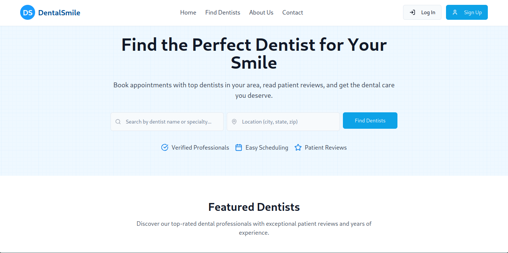

# 🦷 Dental Smile - Dental Appointment System



## 📖 Overview

Dental Smile is a comprehensive dental appointment management system that connects patients with dental professionals. The platform provides an intuitive booking system, real-time chat communication, review management, and administrative tools for managing dental practices.

## ✨ Features

### For Patients
- **Search & Browse Dentists**: Find dentists by location, specialty, and availability with advanced filtering
- **Book Appointments**: Schedule, reschedule, or cancel appointments with real-time availability checking
- **Real-time Chat**: Communicate directly with dentists via Socket.IO-powered chat system
- **Reviews & Ratings**: Read and post reviews about dentists with rating system
- **Profile Management**: Manage personal information and upload profile pictures
- **Dashboard**: View appointment history and manage bookings

### For Dentists
- **Schedule Management**: Set working hours and manage appointment availability
- **Patient Communication**: Real-time chat with patients and appointment notifications
- **Profile Customization**: Showcase expertise, services, and professional information
- **Appointment Overview**: View and manage patient appointments with detailed insights
- **Service Management**: Define and manage offered dental services
- **Reviews Monitoring**: Track patient feedback and ratings

### For Administrators
- **User Management**: Approve dentist applications and manage user accounts
- **System Overview**: Comprehensive dashboard with analytics and system monitoring
- **Service Catalog**: Manage dental services and pricing across the platform
- **Content Management**: Oversee reviews, appointments, and system data

### Core System Features
- **Multi-role Authentication**: JWT-based authentication with role-based access control
- **Real-time Communication**: Socket.IO integration for instant messaging and notifications
- **File Upload**: Cloudinary integration for secure image storage and optimization
- **Responsive Design**: Mobile-first design with Tailwind CSS and Shadcn UI components
- **Type Safety**: Full TypeScript implementation across frontend and backend

---

## 🛠️ Technology Stack

### Frontend
- **React 18** with TypeScript and modern hooks
- **Vite** for fast build tool and development server
- **Tailwind CSS** for utility-first styling
- **Shadcn UI** component library with Radix UI primitives
- **React Router** for client-side routing
- **Socket.IO Client** for real-time communication
- **Axios** with interceptors for API communication
- **Framer Motion** for animations
- **React Query** for server state management

### Backend
- **NestJS** with TypeScript for scalable Node.js framework
- **MongoDB** with Mongoose ODM for database management
- **Socket.IO** for real-time bidirectional communication
- **JWT** for stateless authentication with role-based access
- **Passport** authentication middleware with strategies
- **Cloudinary** for cloud-based image storage and optimization
- **Bcrypt** for password hashing and security

### Development Tools
- **Docker** with Docker Compose for containerization
- **ESLint** for code linting and style enforcement
- **TypeScript** for type-safe development
- **Jest** for testing framework

---

## 🚀 Getting Started

### Prerequisites
- **Node.js** (v18+)
- **MongoDB** (local or cloud instance)
- **Docker** (optional, for containerized development)

### Frontend Setup
```bash
cd frontend
npm install
npm run dev
```
The frontend will be available at `http://localhost:8080`

### Backend Setup
```bash
cd backend
npm install
npm run start:dev
```
The backend API will be available at `http://localhost:3000`

### Using Docker (Recommended)
```bash
# Start all services
docker-compose up -d

# View logs
docker-compose logs -f

# Stop services
docker-compose down
```

### Environment Variables
Create `.env` files in both frontend and backend directories:

**Backend (.env)**
```env
DATABASE_URL=mongodb://localhost:27017/dental-smile
JWT_SECRET=your-jwt-secret
JWT_EXPIRES_IN=7d
CLOUDINARY_CLOUD_NAME=your-cloud-name
CLOUDINARY_API_KEY=your-api-key
CLOUDINARY_API_SECRET=your-api-secret
```

---

## 📋 Project Structure

```
dental-smile/
├── frontend/                   # React frontend application
│   ├── src/
│   │   ├── components/         # Reusable UI components
│   │   │   ├── ui/            # Shadcn UI components (buttons, forms, etc.)
│   │   │   ├── Chat.tsx       # Real-time chat interface
│   │   │   ├── Navbar.tsx     # Navigation with notifications
│   │   │   └── ...            # Feature-specific components
│   │   ├── pages/             # Page components
│   │   │   ├── Dashboard.tsx   # Patient dashboard
│   │   │   ├── DentistDashboard.tsx # Dentist dashboard
│   │   │   ├── Admin.tsx      # Admin dashboard
│   │   │   └── ...            # Authentication and feature pages
│   │   ├── contexts/          # React contexts
│   │   │   └── ChatContext.tsx # Global chat state with Socket.IO
│   │   ├── services/          # API services
│   │   │   └── api.ts         # Centralized API client with Axios
│   │   ├── types/             # TypeScript type definitions
│   │   ├── hooks/             # Custom React hooks
│   │   └── lib/               # Utility functions
│   ├── public/                # Static assets
│   └── package.json
│
└── backend/                    # NestJS backend application
    ├── src/
    │   ├── auth/              # Authentication module (JWT, guards, strategies)
    │   ├── users/             # User management (CRUD, profiles)
    │   ├── appointments/      # Appointment scheduling and management
    │   ├── dentists/          # Dentist-specific functionality
    │   ├── services/          # Dental services catalog
    │   ├── schedules/         # Working hours and availability
    │   ├── reviews/           # Review and rating system
    │   ├── chat/              # Real-time chat (Socket.IO gateway)
    │   ├── common/            # Shared services (Cloudinary, validation)
    │   ├── seeders/           # Database seeding utilities
    │   └── main.ts            # Application entry point
    └── package.json
```

---

## 🔧 Key Features Implementation

### Real-time Chat System
- Socket.IO integration for instant messaging
- Conversation persistence in MongoDB
- Online status and typing indicators
- Unread message notifications
- Error boundaries for chat functionality

### Appointment Management
- Real-time availability checking
- Time slot conflict prevention
- Multi-step booking workflow
- Status tracking and notifications

### Authentication & Authorization
- JWT-based authentication
- Role-based access control (Patient/Dentist/Admin)
- Protected routes with guards
- Password hashing with bcrypt

### File Management
- Cloudinary integration for image uploads
- Profile picture management
- Secure file validation
- Image optimization and transformation

---

## 🧪 Testing

### Frontend Tests
```bash
cd frontend
npm run test
```

### Backend Tests
```bash
cd backend
npm run test
npm run test:e2e
```

### Linting
```bash
# Frontend
cd frontend
npm run lint

# Backend
cd backend
npm run lint
```

---

## 🚢 Deployment

### Docker Production Build
```bash
# Build and start production containers
docker-compose -f docker-compose.prod.yml up -d
```

### Manual Deployment
```bash
# Build frontend
cd frontend
npm run build

# Build backend
cd backend
npm run build
npm run start:prod
```

---

## 🔒 Security Features

- JWT authentication with role-based access control
- Password hashing with bcrypt
- CORS configuration for cross-origin requests
- Input validation and sanitization
- Protected route guards
- Secure file upload validation
- Environment variable management

---

## 📱 API Documentation

The backend provides RESTful APIs for:
- `/auth` - Authentication endpoints
- `/users` - User management
- `/appointments` - Appointment operations
- `/dentists` - Dentist-specific endpoints
- `/services` - Dental services catalog
- `/reviews` - Review and rating system
- `/chat` - Chat history and management

Real-time features available via Socket.IO:
- Chat messaging
- Online status updates
- Appointment notifications

---

## 🤝 Contributing

1. Fork the repository
2. Create a feature branch (`git checkout -b feature/amazing-feature`)
3. Commit your changes (`git commit -m 'Add some amazing feature'`)
4. Push to the branch (`git push origin feature/amazing-feature`)
5. Open a Pull Request

---

## 📷 Demo


---

## 👥 Contributors

- [Arwin Shrestha](https://github.com/sthaarwin)

---

## 📄 License

This project is licensed under the MIT License.

---

## 🙏 Acknowledgements

- [NestJS](https://nestjs.com/) - Progressive Node.js framework
- [React](https://reactjs.org/) - Frontend library
- [Tailwind CSS](https://tailwindcss.com/) - Utility-first CSS framework
- [Shadcn UI](https://ui.shadcn.com/) - Re-usable component library
- [MongoDB](https://www.mongodb.com/) - NoSQL database
- [Socket.IO](https://socket.io/) - Real-time communication
- [Cloudinary](https://cloudinary.com/) - Cloud-based image management
- [Vite](https://vitejs.dev/) - Next generation frontend tooling